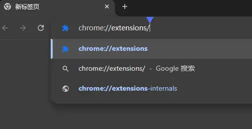
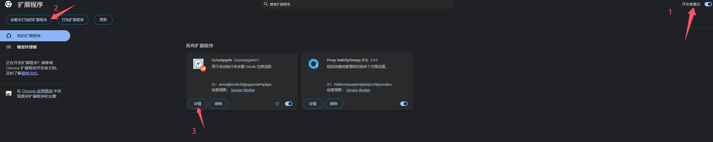
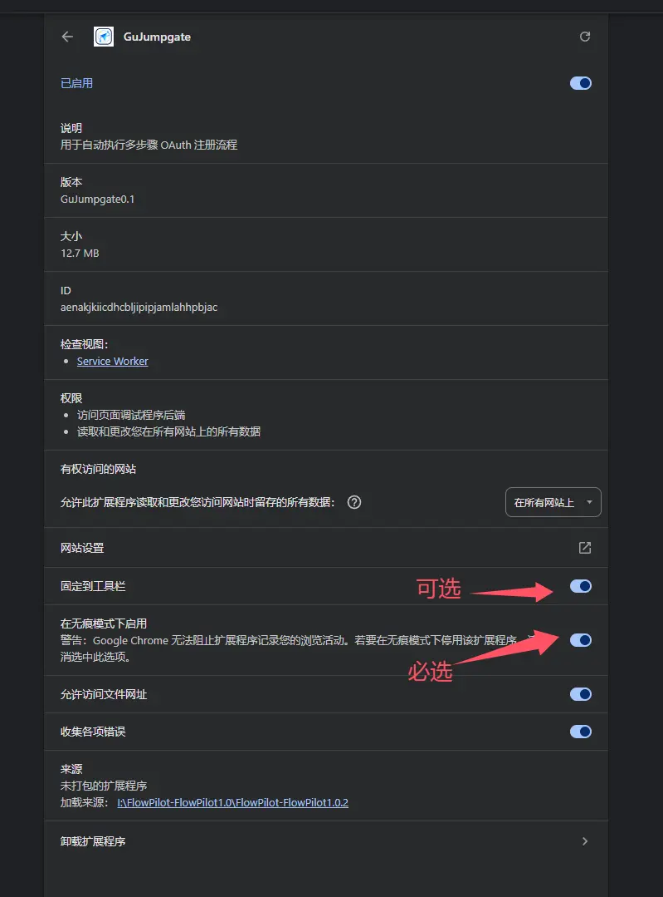
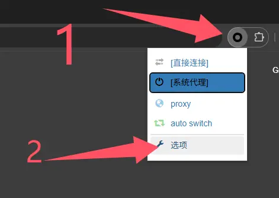
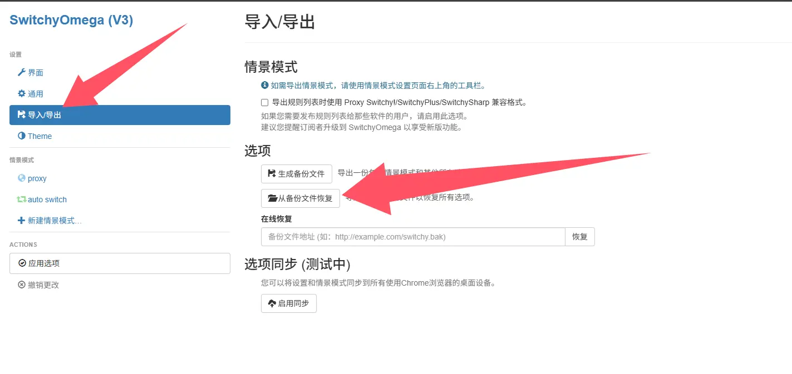
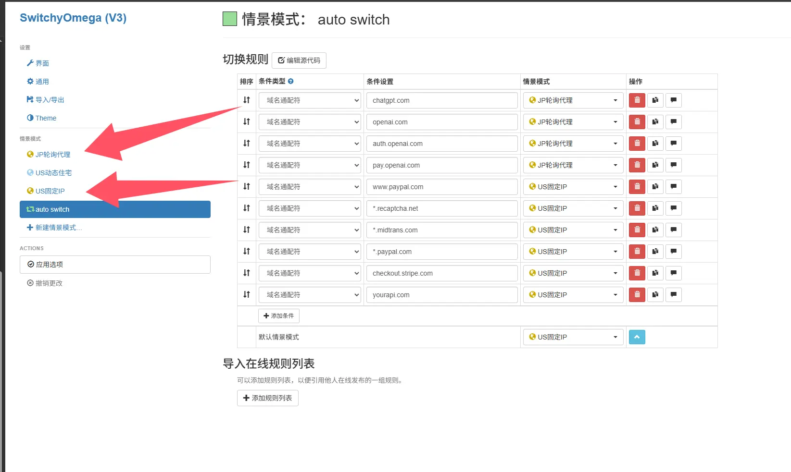
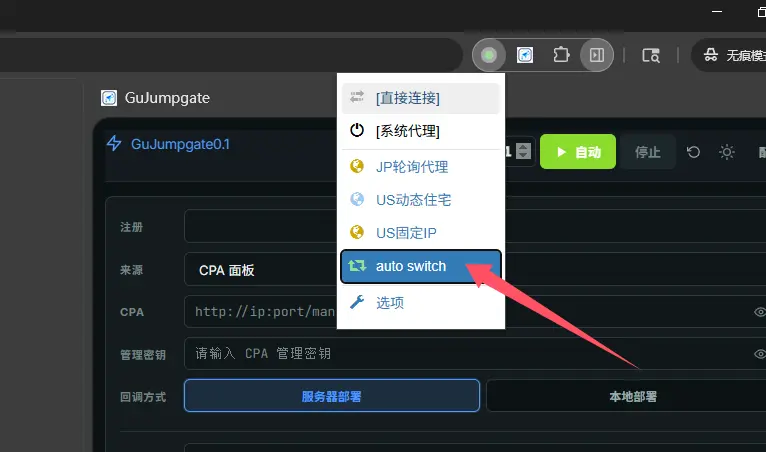
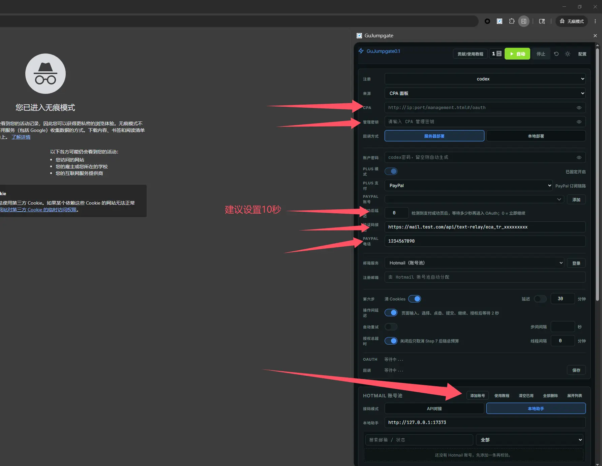
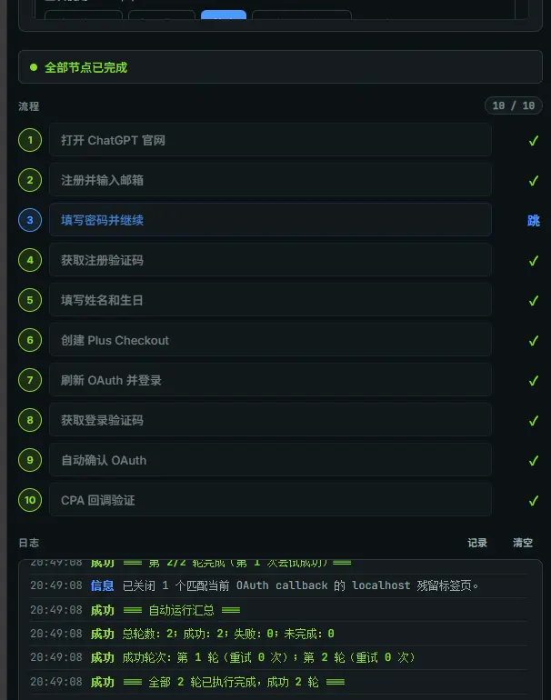

一个也许能"真正解放双手"的全自动GPT PLUS注册浏览器扩展

如果能帮上你，给我点个Star✨，谢谢噜~

已实现全流程自动：
1.自动注册Free账号
(借助FlowPilot项目实现Free账号的自动注册)
2.PAYPAL激活PLUS全流程
- 自动跳转
- 自动跳转Stripe长链接
- 自动填写Stripe账单，自动跳转PayPal
- 自动填写PayPal账单，自动完成流程
(移植并完善了自己之前发布的油猴JS脚本至扩展中)
3.自动CPA OAuth回调
(修改了FlowPilot的回调流程)

前提要求：
1. 1个带API且能连续正常接收PayPal验证码的US+1接码手机号
2. 1个或N个支持IMAP&Graph的Outlook邮箱
3. 1个或N个支持GPT注册的JP代理 (N个批量注册轮询)
4. 1个相对干净支持PAYPAL注册的US代理
5. 1个支持分流的代理工具
6. 1个已经搭建好的CPA的面板(自动OAuth回调) 
   
实现效果：连续10次串行运行，注册并激活PLUS 100%成功率
运行环境：Chrome 148.0.7778.168 (64位正式版本) 开启无痕模式
网络环境：JP万人骑代理轮询 + US自建代理

完整喂饭教程：
到本仓库的 Releases 页面下载扩展压缩包，解压后使用；如果你是二次开发者，也可以直接下载源码并以“加载已解压的扩展程序”方式导入。
Chrome浏览器 chrome://extensions/ 打开开发者模式

选择加载为未打包的扩展程序，选择刚才解压出的文件夹

在扩展程序的详情内勾选在无痕模式下启用，ZeroOmega同理

在代理工具配置好注册登录与PayPal、Stripe的分流
我这里使用的是[ZeroOmega](https://chromewebstore.google.com/detail/pfnededegaaopdmhkdmcofjmoldfiped?utm_source=item-share-cb) 你可以同样通过Mihomo等支持分流的优秀代理工具进行分流

你可以直接导入我的ZeroOmega分流配置
！但请注意，所有代理都是示例值，需要自行修改

总之，分流规则就是让注册走JP，让支付走US，就这么简单
（如果你的cpa部署在本地，那你还需要把cpa的地址设置为直连）

运行解压出文件夹内的start-hotmail-helper.bat

启动无痕浏览器，ZeroOmega选择auto switch

扩展内点击扩展呼出侧边窗口
配置CPA、管理密钥，填入接码API，PAYPAL接码电话， (记得要保存) ， 然后导入Outlook邮箱

然后运行即可

## 版权与来源说明

本项目基于开源项目 [QLHazyCoder/FlowPilot](https://github.com/QLHazyCoder/FlowPilot) 进行修改、移植与二次开发，其部分早期代码与 [whwh1233/StepFlow-Duck](https://github.com/whwh1233/StepFlow-Duck) 具有共同历史。

原项目及其相关开源部分采用 MIT License 发布。根据 MIT License，你可以在保留原版权声明和许可声明的前提下使用、修改、分发本项目的相关代码。

为避免歧义，原项目作者、历史贡献者与当前二开版本之间不存在默认的认可、担保或背书关系。本项目中新增的适配、流程调整、脚本移植与文档整理内容，除另有说明外，均由当前维护者负责。

如果你分发本项目或其修改版本，请一并保留仓库中的 `LICENSE` 及相关来源说明文件。

## 使用与发布提示

- 发布你自己的二开版本前，建议先检查代码、默认配置与截图中是否包含真实账号、密钥、代理、手机号、邮箱、Cookie 或回调地址
- 若你继续分发本项目或其修改版，请同步保留 `LICENSE` 与 `THIRD_PARTY_NOTICES.md`
- 使用者应自行遵守目标平台服务条款、适用法律及其所在地区的监管要求
